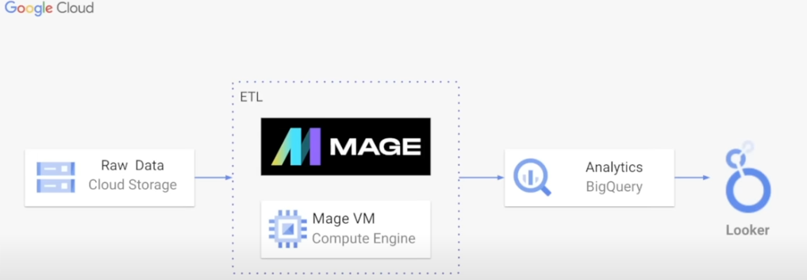

######
Modern Data Engineering Project 

### Architecture Diagram

Cloud Storage is where data will be stored. Then transformation logic will be applied using python and deployed into the open source data pipeline tool Mage, Computer Engine. The next step will be to load the data into the data warehouse BigQuery available on Google Cloud Platform (GCP). Finally, data will be passed into Looker for data visualization. 

#### GCP Services

**Cloud Storage**: Cloud Data Storage is an online file storage service provided by Google as part of its cloud computing platform. It allows you to store and retrieve your data in the cloud making it accessible from anywhere with an internet connection. 

**Compute Engine**: Google Compute Engine is a cloud computing service that provides virtual machines for running applications and services. It allows you to easily create, configure and manage virtual machines with various operating systems 

**BigQuery**: is a cloud-based data warehouse provided by Google Cloud PLatform that allows you to store, analyze, and query large datasets using SQL-like syntax. It is a serverless, highly scalable, and cost-effective solution that can process and analyze terabytes to petabytes of data in real time. 

**Looker Studio**: is a web-based data visualization and reporting tool that allows you to create interactive dashboards and reports from a variety of data sources, including Google Analytics, Google Sheets, and BigQuery. It enables you to turn your data into informative and engaging visualizations.

### Other Tools

**Mage**: Open-source data pipeline tool for transforming and integrating data. Similar to Airflow but more interactive and added features. 

### Fact & Dimension Table

#### Fact Table:
- Contains quantitative measures or metrics that are used for analysis
- Typically contains foreign keys that link to dimension tables
- Contains columns that have high cardinality and change frequently. High Cardinality being a column or row in a database that has a large number of distinct values, or unique entities. It's the opposite of low cardinality, which is when a column or row has many repeated values

#### Dimension Table
- Contains columns that describe attributes of the data being analyzed
- Typically contains primary keys that link to fact tables
- Contains columns that have low cardinality and don't change frequently 
- Contains columns that can be used for grouping or filtering data for analysis

######